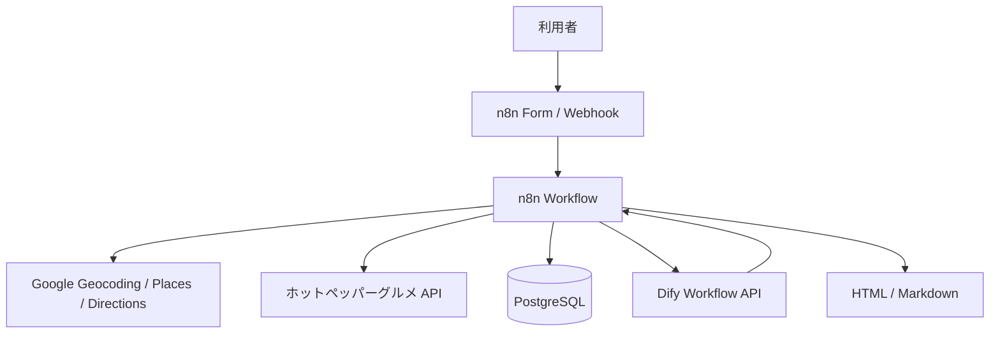

# 全体設計

## 目的

このアプリは、駅周辺のランチ候補を検索するだけではなく、次の 3 つを同時に満たすことを重視します。

1. 食事条件
2. 快適性
3. 安全側の不確実性管理

特に `サラダバー`、`タンパク質`、`野菜`、`糖質調整`、`空調`、`階段リスク` のような曖昧な情報は、API の生データだけで断定せず、`Dify` と `manual_checks` を併用して扱います。

## システム構成

## 責務分担

### n8n

- 入力受付
- API 呼び出し
- DB キャッシュ確認
- 手動確認の優先適用
- Dify 呼び出し制御
- スコアリング
- 出力整形

### Dify

- メニュー・口コミ・建物文脈からの曖昧判定
- JSON 形式での補助評価返却

### PostgreSQL

- 店舗マスタ
- 判定履歴
- 手動確認履歴
- 検索履歴
- 建物キーワードとチェーン補正ルール

## データフロー

1. 入力受信
2. 駅座標取得
3. 周辺店候補取得
4. Place Details 取得
5. ホットペッパー補完
6. `shops` へ upsert
7. `manual_checks` 参照
8. 必要な店舗のみ Dify 判定
9. `shop_judgements` 保存
10. スコアリング
11. `おすすめ`、`条件付き候補`、`避けた候補` に分類
12. `search_logs` 保存
13. レスポンス返却

## キャッシュ方針

- `shops` は店舗基本情報の再利用
- `shop_judgements` は同日同時刻帯または直近判定の再利用
- `manual_checks` は最優先で上書き適用
- API エラー時はキャッシュ優先で結果を返す

## 重要ルール

- AI に候補探索をさせない
- 営業、禁煙、空調、階段は未確認なら未確認として扱う
- 4 月 20 日から 6 月 10 日は空調リスクを上げる
- `雑居ビル上階` と `階段 high` は強い減点または除外対象
